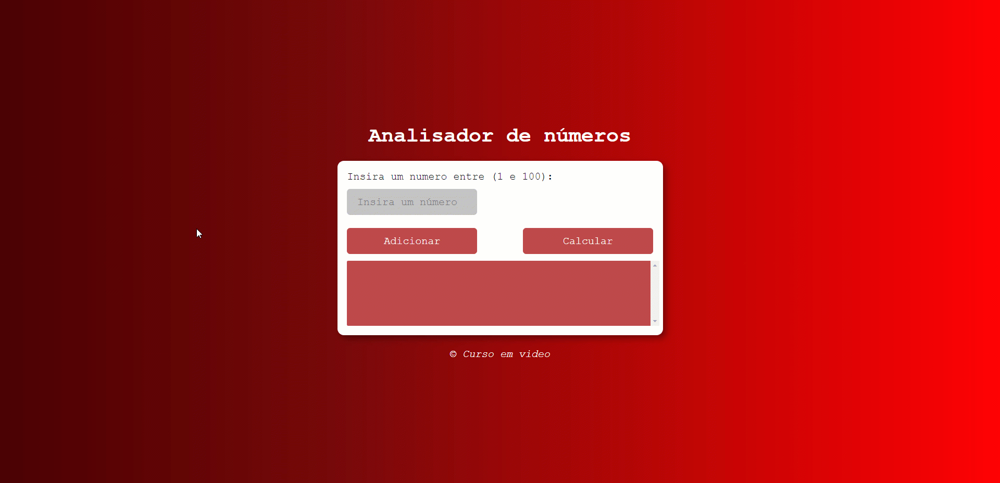

<h1 align ="center">
Analisador de números
 

 
</h1>

## 📖 Sobre o projeto

**Layout simples para empregar o uso de:**

- Input (Entrada de dados)
- Buttons (Botões)
- Validation (Validação em JavaScript)
- interaction between JavaScript and HTML(Manuseio do HTML com JavaScript)

## 🤖 Tecnologias

**Tecnologias usadas no layout**

- [HTML 5](https://www.w3schools.com/html/)
- [CSS 3](https://www.w3schools.com/css/)
- [JavaScript](https://www.w3schools.com/js/DEFAULT.asp)
